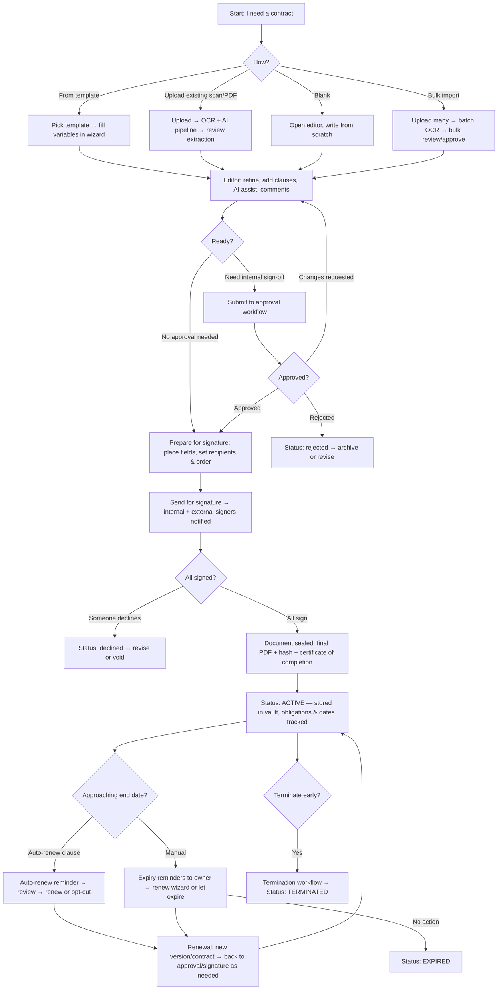
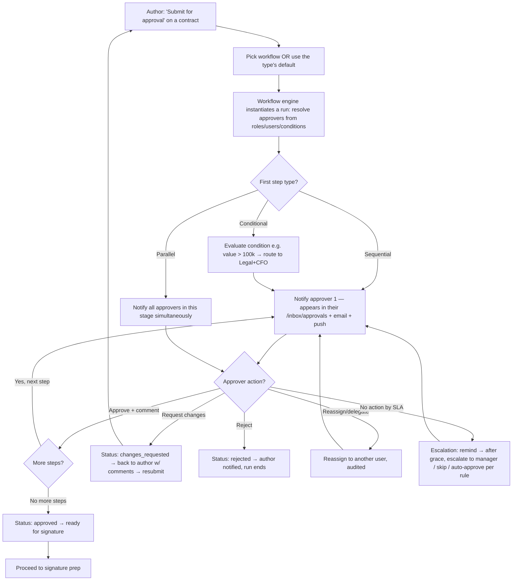

# 05 — User Flows

End-to-end journeys with mermaid diagrams. These are the canonical flows; screens in Docs 06–08 reference them.

---

## 1. The master flow — contract lifecycle (create → renew)



---

## 2. Authentication & MFA

```mermaid
flowchart TD
    A[Visit app / open invite] --> B{Has account?}
    B -->|No, has invite| C[Accept invite: set password OR link SSO] --> H
    B -->|Yes| D[Login: email + password OR 'Continue with SSO']
    D -->|SSO| E[Redirect to IdP → SAML/OIDC callback] --> H
    D -->|Password| F{Credentials valid?}
    F -->|No| G[Show error, rate-limit, optional captcha after N tries] --> D
    F -->|Yes| M{MFA enabled / required by org policy?}
    M -->|No| H
    M -->|Yes| N[Choose factor: TOTP app / SMS OTP / email OTP / WebAuthn]
    N --> O{Code valid?}
    O -->|No| P[Retry, lock after N attempts, offer recovery codes] --> N
    O -->|Yes| H[Issue JWT access (short TTL) + refresh token (httpOnly, rotating)]
    H --> I{First login for this tenant & I'm owner?}
    I -->|Yes| J[/onboarding wizard]
    I -->|No| K[/dashboard]
    K --> L{Access token expired?}
    L -->|Yes| Q[Silent refresh via refresh token] -->|reuse detected| R[Revoke session, force re-login]
    Q -->|ok| K
```
Step-up auth: sensitive actions (export audit, change roles, delete workspace, disable MFA, manage API keys, sign with high-assurance) re-prompt for password/MFA even within a valid session; the elevated state is short-lived and audited.

---

## 3. OCR + AI ingestion flow (the differentiator — full UX in Doc 09)

```mermaid
flowchart TD
    A[/intelligence/upload — drag files / camera / cloud picker] --> B[Client: validate type/size, show file rows]
    B --> C[Upload to S3 via presigned URLs, per-file progress in ProgressTray]
    C --> D[Create OCR job → enqueue on 'ocr' queue, return jobId]
    D --> E[/intelligence/jobs/:jobId — live processing screen]
    E --> F[Worker: per page → preprocess: auto-rotate, deskew, denoise, enhance, auto-crop]
    F --> G[OCR engine: detect language(s) per region → Arabic + English + others]
    G --> H[Layout analysis: paragraphs, tables, headers/footers, signature blocks, stamps]
    H --> I[Detect: signature regions, stamps/seals, handwriting, logos]
    I --> J[Assemble structured text + bounding boxes + per-token confidence]
    J --> K[AI pass: classify contract type · extract metadata party/dates/value/term · detect clauses · risk analysis · obligations · summary · smart tags · confidence per field]
    K --> L[Persist: ocr_results + ai_extractions JSONB, link to document & pages]
    L --> M[Emit OCRCompleted event → notify user, ProgressTray item 'Review ready']
    M --> N[/intelligence/jobs/:jobId/review — side-by-side review]
    N --> O[Left: original page w/ highlight boxes ⟷ Right: extracted fields w/ confidence chips]
    O --> P{Field confidence?}
    P -->|≥90% green| Q[Pre-filled, accepted, source-linked]
    P -->|60–89% amber| R[Flagged 'review' — included in 'Verify all' sweep]
    P -->|<60% red / not found| S[Empty or highlighted — user enters/corrects manually]
    Q --> T[User runs 'Verify all' → walks only uncertain fields]
    R --> T
    S --> T
    T --> U[Confirm → create Contract from extraction, attach source files, status: draft]
    U --> V[Open contract detail / editor → continue master flow]
    K -.retry on low overall confidence or user request.-> F
```

---

## 4. Approval workflow execution


Run history view: per contract, a vertical timeline of stages with who/when/decision/comment/duration; aggregate view per workflow: where runs are stuck (bottleneck heatmap), average time per stage, SLA breach rate.

---

## 5. Signature placement → signing ceremony

```mermaid
flowchart TD
    A[Contract approved → 'Prepare for signature'] --> B[/contracts/:id/prepare-signature]
    B --> C[Add recipients: name, email, role signer/approver/CC, signing order, auth level email/OTP/ID]
    C --> D[DocViewer + field palette: drag Signature / Initials / Date / Text / Checkbox / Name / Title onto pages, assign each to a recipient, set required]
    D --> E[Validate: every required signer has ≥1 signature field; no overlaps; preview]
    E --> F['Send' → generate signing tokens, email each recipient in order, set status out_for_signature]
    F --> G{Recipient opens /sign/:token}
    G --> H[Identity step: OTP to email/phone if required → verify]
    H --> I[Consent: 'I agree to use electronic records & signatures' (e-sign disclosure)]
    I --> J[Guided ceremony: scroll doc, fields pulse where action needed, fill them in order]
    J --> K[Adopt signature: type / draw / upload image → applied to all their fields]
    K --> L[Review summary → 'Finish' → record: signed image, timestamp, IP, device, geo, hash of doc-at-signing]
    L --> M{All recipients done?}
    M -->|No| N[Notify next recipient (sequential) / wait (parallel)] --> G
    M -->|Yes| O[Flatten final PDF: embed signatures, audit-trail page, generate Certificate of Completion]
    O --> P[Compute final hash, store sealed PDF + certificate in vault, status: signed → active]
    P --> Q[Notify all parties: 'Fully executed — download your copy', external signers get a link to their copy]
    G -->|Declines| R[Status: declined → author notified w/ reason → revise or void]
    G -->|Expires unsigned| S[Reminder cadence → after final reminder, status: expired-unsigned → author re-sends or voids]
```

---

## 6. Renewal & expiry tracking

```mermaid
flowchart TD
    A[Nightly Celery beat job: scan active contracts] --> B{End date within notice window? e.g. 90/60/30/7 days}
    B -->|Yes| C[Create 'expiring' alerts → owner + watchers; surface on dashboard; add to /reports/renewals]
    B -->|No| A
    C --> D{Auto-renew clause detected/flagged?}
    D -->|Yes| E[Reminder: 'Auto-renews on {date} for {term} unless cancelled by {opt-out date}' → owner reviews]
    D -->|No| F[Reminder: 'Expires {date} — renew?' → owner opens renewal wizard]
    E -->|Let it renew| G[On renewal date: spawn new version/period, status active, new end date, log it]
    E -->|Opt out| H[Send termination/non-renewal notice (template) → status terminated/expired at end date]
    F -->|Renew| I[Renewal wizard: clone contract, adjust terms/dates/values, run approval/signature as needed → new active]
    F -->|Renegotiate| J[Open editor on a new draft version → master flow]
    F -->|Let expire| K[On end date: status expired, archived, still searchable & auditable]
    I --> L[Old contract linked to new as 'renewed by'; obligations & dashboards updated]
    G --> L
```

---

## 7. External signer / client portal (no account)

```mermaid
flowchart TD
    A[Email: 'You've been asked to sign {Contract} by {Org}'] --> B[Click secure link /sign/:token]
    B --> C{Link valid & not expired/revoked?}
    C -->|No| D[Friendly 'this link is no longer active — contact {sender}']
    C -->|Yes| E[Branded portal: org logo/colors, doc title, sender, due date]
    E --> F{Auth required?}
    F -->|Email/SMS OTP| G[Send code → verify]
    F -->|None| H
    G --> H[Show e-sign consent + 'View documents']
    H --> I[Read the contract (DocViewer, can download a draft watermark copy, can comment if allowed)]
    I --> J{Action}
    J -->|Sign| K[Ceremony: fill fields → adopt signature → finish → confirmation + 'we'll email your copy']
    J -->|Decline| L[Reason → submit → sender notified]
    J -->|Need changes| M[Comment / message sender (if collaboration enabled) → sender revises → new link]
    K --> N[Later: receive 'fully executed' email w/ link to download signed copy + certificate; link self-expires]
    E --> O[Optional 'magic' account creation offer: 'Manage all your agreements with {Org} — create a free account']
```

---

## 8. New-tenant onboarding

```mermaid
flowchart TD
    A[Sign up / provisioned by sales] --> B[Verify email] --> C[/onboarding]
    C --> D[Step 1: Workspace — name, logo, default language EN/AR, timezone, date format, Hijri toggle]
    D --> E[Step 2: Invite teammates — emails + roles (skippable)]
    E --> F[Step 3: Starter content — pick template pack(s) + seed clause library (bilingual)]
    F --> G[Step 4: Default approval workflow — pick a preset or 'build later']
    G --> H[Step 5: Try it — guided 'create your first contract' OR 'scan a document' demo]
    H --> I[/dashboard with a 'Finish setup (3/6)' checklist card + product tour overlay]
    I --> J{Plan?}
    J -->|Trial| K[Trial banner: 'X days left' → /settings/billing to upgrade]
    J -->|Paid| L[Normal]
```

---

## 9. Day-in-the-life micro-flows (the ones that must be 2-tap)

- **Approver, from email:** email → "Review" → (auth/SSO if needed) → contract detail with the approval panel open → read summary + risk flags → "Approve" (+ optional comment) → done. On mobile: same, ≤ 3 taps.
- **Signer, from email:** email → "Sign" → OTP (if required) → consent → ceremony → done. Designed for one-handed mobile.
- **Exec glance:** open app → dashboard → "5 expiring in 30 days" → click → renewals report → done.
- **Author chasing a stuck contract:** ⌘K → type contract name → open → Approvals tab → see who's blocking + how long → "Remind" → done.
- **Anyone, "where is X?":** ⌘K → fuzzy search → open. Always available, everywhere.
