# 15 — Database Architecture (PostgreSQL)

The system of record. **Shared DB, shared schema, `tenant_id` on every tenant-scoped row, enforced by Row-Level Security** + a mandatory repo-layer filter (defense in depth). Contract **versioning** (immutable snapshots), an **append-only hash-chained audit log**, structured **JSONB** for OCR/AI results and workflow graphs, **time-partitioning** on the big append-only tables, **read replicas** for analytics, **`pgvector`** for semantic search. UUID (v7, time-ordered) primary keys. All timestamps `timestamptz` (UTC). Soft-delete via `deleted_at` where deletion must be reversible; hard-delete only on explicit purge (and the audit entry survives).

---

## 1. Conventions

- **PK:** `id uuid` (UUIDv7 — sortable by creation time, index-friendly). **Tenant key:** `tenant_id uuid not null` on every tenant-scoped table, first column of (almost) every index. **Audit columns:** `created_at`, `updated_at`, `created_by`, `updated_by` everywhere. **Optimistic lock:** `version int` (or rely on `updated_at`) on mutable aggregates. **Soft delete:** `deleted_at timestamptz null` where needed; partial indexes `WHERE deleted_at IS NULL`.
- **RLS:** `ALTER TABLE … ENABLE ROW LEVEL SECURITY; CREATE POLICY tenant_isolation ON … USING (tenant_id = current_setting('app.current_tenant')::uuid);` on every tenant-scoped table; a privileged role bypasses for cross-tenant jobs.
- **JSONB** for genuinely schemaless/variable data (OCR results, AI extractions, workflow graphs, custom-field *values*, event payloads, settings blobs) — with GIN indexes on the paths we query; structured columns for everything we filter/sort/join on.
- **Enums** as `text` + a `CHECK` constraint (or a lookup table where values are tenant-configurable) — easier to evolve than PG `ENUM` types.
- **Partitioning** (declarative, by month, on `created_at`) for: `audit_log`, `activity_events`, `notifications`, `jobs`, `webhook_deliveries`, `workflow_run_events`, `ocr_pages` (if huge). A beat job creates next month's partitions ahead of time and detaches/archives old ones.
- **Money:** `numeric(20,4)` + a `currency char(3)`; never floats.

---

## 2. ERD (logical — the core)

```mermaid
erDiagram
    TENANT ||--o{ USER : has
    TENANT ||--o{ TEAM : has
    TENANT ||--o{ ROLE : has
    TENANT ||--o{ CONTRACT : owns
    TENANT ||--o{ TEMPLATE : owns
    TENANT ||--o{ CLAUSE : owns
    TENANT ||--o{ WORKFLOW_DEFINITION : owns
    TENANT ||--o{ AUDIT_LOG : records
    USER ||--o{ USER_TEAM : member
    TEAM ||--o{ USER_TEAM : member
    USER }o--|| ROLE : has
    ROLE ||--o{ ROLE_PERMISSION : grants
    CONTRACT ||--o{ CONTRACT_VERSION : "has versions"
    CONTRACT ||--o{ CONTRACT_PARTY : "has parties"
    CONTRACT ||--o{ CONTRACT_CUSTOM_FIELD_VALUE : "has values"
    CONTRACT ||--o{ CONTRACT_ATTACHMENT : "has files"
    CONTRACT ||--o{ CONTRACT_OBLIGATION : "has obligations"
    CONTRACT ||--o{ ACL_ENTRY : "shared via"
    CONTRACT }o--o| TEMPLATE : "created from"
    CONTRACT }o--o| CONTRACT : "renews / amends"
    TEMPLATE ||--o{ TEMPLATE_VARIABLE : defines
    TEMPLATE }o--o{ CLAUSE : "default clauses"
    CONTRACT ||--o{ WORKFLOW_RUN : "goes through"
    WORKFLOW_DEFINITION ||--o{ WORKFLOW_VERSION : versions
    WORKFLOW_RUN }o--|| WORKFLOW_VERSION : "ran on"
    WORKFLOW_RUN ||--o{ WORKFLOW_RUN_STEP : steps
    WORKFLOW_RUN ||--o{ WORKFLOW_RUN_EVENT : timeline
    CONTRACT ||--o{ SIGNATURE_ENVELOPE : "signed via"
    SIGNATURE_ENVELOPE ||--o{ SIGNATURE_RECIPIENT : recipients
    SIGNATURE_ENVELOPE ||--o{ SIGNATURE_FIELD : fields
    SIGNATURE_RECIPIENT ||--o{ SIGNATURE_FIELD : "assigned to"
    SIGNATURE_RECIPIENT ||--o{ SIGNATURE_EVENT : "viewed/signed/declined"
    SIGNATURE_ENVELOPE ||--o| CERTIFICATE_OF_COMPLETION : produces
    CONTRACT ||--o{ OCR_JOB : "ingested via"
    OCR_JOB ||--o{ OCR_FILE : files
    OCR_FILE ||--o{ OCR_PAGE : pages
    OCR_JOB ||--o| AI_EXTRACTION : produces
    CONTRACT ||--o{ AI_ANALYSIS : "analyzed by"
    CONTRACT ||--o{ COMMENT : "has comments"
    CONTRACT ||--o{ ACTIVITY_EVENT : "stream"
    USER ||--o{ NOTIFICATION : receives
    TENANT ||--o{ JOB : runs
    TENANT ||--|| PLAN : "on plan"
    TENANT ||--o{ USAGE_RECORD : meters
    TENANT ||--o{ API_TOKEN : issues
    TENANT ||--o{ WEBHOOK_ENDPOINT : configures
    WEBHOOK_ENDPOINT ||--o{ WEBHOOK_DELIVERY : delivers
    TENANT ||--o{ FILE_OBJECT : stores
    CLAUSE ||--o{ CLAUSE_VERSION : versions
    CLAUSE ||--o{ CLAUSE : "fallback of"
```

---

## 3. Key tables (selected — columns abbreviated)

**`tenants`** — `id, name, subdomain (unique), status (active|suspended|deleted), plan_id, region, default_locale, default_currency, hijri_enabled, branding jsonb, settings jsonb, feature_flags jsonb, created_at, …`. Not RLS-scoped (it *is* the tenant); accessed via the tenant resolver.

**`users`** — `id, tenant_id, email (unique per tenant), name, status (active|invited|deactivated), role_id, password_hash (null if SSO-only), mfa_enabled, mfa_secret (encrypted), is_sso, sso_subject, locale, theme, notification_prefs jsonb, last_active_at, deactivated_at, created_at, …`. + **`sessions`** (`id, user_id, tenant_id, refresh_token_hash, parent_token_hash (rotation chain — reuse detection), device jsonb, ip, created_at, expires_at, revoked_at`), **`mfa_factors`** (`id, user_id, type (totp|sms|email|webauthn), secret/credential (encrypted), confirmed_at`), **`recovery_codes`** (`id, user_id, code_hash, used_at`), **`teams`** + **`user_teams`** (M:N), **`roles`** (`id, tenant_id, name, is_system bool, …`) + **`role_permissions`** (`role_id, permission text, scope text` — e.g. `('contracts.edit','team')`), **`permissions`** (the catalog — static seed). External users: **`external_contacts`** (`id, tenant_id, email, name, company` — referenced by signature recipients and ACL share grants; no login).

**`contracts`** — `id, tenant_id, reference_no (unique per tenant), title, type, family, status (draft|in_review|changes_requested|approved|out_for_signature|signed|active|expiring|expired|terminated|rejected|voided|superseded|archived), owner_id, department_id, language (en|ar|bilingual), template_id, template_version, parent_contract_id (amends), renews_contract_id, renewed_by_contract_id, effective_date, end_date, term_months, value numeric, currency, payment_terms, renewal_type (none|auto|manual), notice_period_days, governing_law, risk_level (low|medium|high|critical), risk_summary, ai_summary_en, ai_summary_ar, current_version_id, tags text[], legal_hold bool, watchers uuid[], metadata jsonb, version int, deleted_at, created_at, updated_at, created_by, updated_by`. Indexes: `(tenant_id, status, updated_at desc)`, `(tenant_id, owner_id)`, `(tenant_id, end_date)` (partial `WHERE status='active'`), `(tenant_id, type)`, GIN on `tags`, GIN on `metadata`, `tsvector` (title + party names + clause text) for FTS, `pg_trgm` on `title`/party names.

**`contract_versions`** — `id, contract_id, tenant_id, version_no, document jsonb (the full block document snapshot), rendered_pdf_file_id, content_hash, label, change_summary jsonb, metadata_snapshot jsonb, created_by, created_at`. **Immutable** (insert-only; no UPDATE/DELETE in app code). The `signed` version is flagged; the sealed PDF + its hash live here too. **`contract_parties`** (`id, contract_id, tenant_id, side (us|counterparty), legal_entity_id (if us) / external_contact_id (if counterparty), role_label, signatory_name, signatory_email, address, …`). **`contract_custom_field_values`** (`contract_id, tenant_id, field_id, value jsonb`) against **`custom_field_defs`** (`id, tenant_id, name, type, options jsonb, applies_to_types text[], required`). **`contract_attachments`** / **`contract_obligations`** (`id, contract_id, tenant_id, description, party (us|counterparty), due_date, recurrence, status (open|done|missed), reminder_offsets int[], source (ai|manual), created_at`). **`acl_entries`** (`id, tenant_id, resource_type, resource_id, grantee_type (user|team|external|public_in_org|link), grantee_id / external_contact_id / link_token_hash, permission (view|comment|suggest|sign|edit), expires_at, passcode_hash, created_by, created_at, revoked_at`) — the resource-level sharing model; link tokens for the external portal live here.

**`legal_entities`** (`id, tenant_id, name, registration_no, address, …` — the companies the tenant signs *as*).

**`templates`** (`id, tenant_id, name, category, language (en|ar), status (draft|in_review|published|archived), current_version_id, default_workflow_id, applies_to_types text[], language_pair_id (links EN↔AR), usage_count, …`) + **`template_versions`** (`id, template_id, version_no, document jsonb, created_at, …`, immutable) + **`template_variables`** (`id, template_id, name, type, options jsonb, default jsonb, required, help_text, validation jsonb`) + **`template_default_clauses`** (`template_id, clause_id, locked bool, position`). **`clauses`** (`id, tenant_id, title, type, jurisdictions text[], risk_level, risk_rationale, use_when, dont_use_when, language (en|ar), status (draft|legal_review|approved|deprecated), replacement_clause_id, language_pair_id, current_version_id, usage_count, …`) + **`clause_versions`** (`id, clause_id, version_no, body jsonb, created_at, …`, immutable) + **`clause_fallbacks`** (`clause_id, fallback_clause_id, rank (preferred|acceptable|walk_away)`). + **`clause_embeddings`** / **`contract_embeddings`** (`id, tenant_id, source_type, source_id, version_id, embedding vector(1536), text_excerpt, model`) with an HNSW index — powers semantic search.

**`workflow_definitions`** (`id, tenant_id, name, status (draft|active|archived), default_for_types text[], current_version_id, …`) + **`workflow_versions`** (`id, definition_id, version_no, graph jsonb {nodes[], edges[]}, created_by, created_at`, immutable) + **`workflow_runs`** (`id, tenant_id, contract_id, definition_id, version_id, status (running|approved|rejected|changes_requested|cancelled), context jsonb (the contract snapshot the engine evaluates), current_node_ids text[], started_at, completed_at, started_by`) + **`workflow_run_steps`** (`id, run_id, tenant_id, node_id, node_type, status (pending|active|approved|rejected|changes_requested|skipped|expired), assignees jsonb (resolved at runtime), required_rule, decision, decided_by, decided_at, comment, sla_due_at, sla_breached_at, escalated_to, reminder_count`) + **`workflow_run_events`** (`id, run_id, tenant_id, event, payload jsonb, at`) — partitioned by month.

**`signature_envelopes`** (`id, tenant_id, contract_id, contract_version_id, status (draft|sent|partially_signed|completed|declined|expired|voided), message, signing_order (sequential|parallel|custom), reminder_every_days, expires_at, completed_at, sealed_pdf_file_id, sealed_hash, certificate_file_id, created_by, sent_at`) + **`signature_recipients`** (`id, envelope_id, tenant_id, sequence int, user_id / external_contact_id, name, email, recipient_role (signer|approver|cc|in_person_signer), auth_level (none|email_otp|sms_otp|id_verification), status (created|sent|viewed|signed|declined|expired), access_token_hash, consent_at, signed_at, declined_reason, ip, user_agent, geo jsonb, device_fingerprint`) + **`signature_fields`** (`id, envelope_id, tenant_id, recipient_id, page int, x numeric, y numeric, w numeric, h numeric, type (signature|initials|date|name|title|text|checkbox|attachment|stamp), required bool, prefilled_value, value (filled at signing), anchor jsonb (text-anchor for resilience to page shifts)`) + **`signature_events`** (`id, envelope_id, recipient_id, tenant_id, event (sent|opened|viewed_page|consented|signed_field|finished|declined|reminder_sent), payload jsonb, at, ip`) + **`certificates_of_completion`** (`id, envelope_id, tenant_id, file_id, summary jsonb (parties, timestamps, hashes, IPs, auth levels), timestamp_authority_token`).

**`ocr_jobs`** (`id, tenant_id, status (queued|running|partial|completed|failed|cancelled), created_by, post_action (create_one_per_file|create_one_merged|extract_only), default_metadata jsonb, options jsonb (langs, preprocess flags, engine), progress int, started_at, completed_at, error`, links to a `jobs` row) + **`ocr_files`** (`id, ocr_job_id, tenant_id, file_id (S3 ref), original_name, page_count, status, content_hash`) + **`ocr_pages`** (`id, ocr_file_id, tenant_id, page_no, status, languages text[], result jsonb (text + blocks + bounding boxes + per-token confidence + detected signatures/stamps/tables), avg_confidence numeric, error`) — partitioned by month if large + **`ai_extractions`** (`id, tenant_id, ocr_job_id / contract_id, model, prompt_version, fields jsonb (each: value, source_span, confidence), detected_clauses jsonb, tables jsonb, summary_en, summary_ar, smart_tags text[], created_at`, with human-override tracking: `overrides jsonb`) + **`ai_analyses`** (`id, tenant_id, contract_id, contract_version_id, model, prompt_version, classification jsonb, clauses jsonb, risks jsonb (each: severity, clause_ref, rationale, suggested_fix, status (open|accepted|requested_change)), missing_clauses jsonb, obligations jsonb, summary jsonb, overall_risk, confidence numeric, is_stale bool, created_at, created_by_user_id (null=system)`). **`ai_messages`** (`id, tenant_id, context_type, context_id, user_id, role (user|assistant), content, citations jsonb, rating int, created_at` — the assistant's per-context history).

**`comments`** (`id, tenant_id, resource_type, resource_id, version_anchor jsonb (block id / selection), parent_comment_id, author_type (user|external), author_id, body, mentions uuid[], resolved_at, resolved_by, deleted_at, created_at`). **`suggestions`** (`id, tenant_id, contract_id, version_id, author_id, ops jsonb (the tracked changes), status (open|accepted|rejected), reviewed_by, reviewed_at, created_at`).

**`audit_log`** — `id uuid (v7), tenant_id, at timestamptz, actor_type (user|external|system|service_account), actor_id, actor_label, action text (namespaced, e.g. 'contract.signed'), object_type, object_id, object_label, metadata jsonb (before→after diff, request_id, job_id, etc.), severity, ip, user_agent, geo jsonb, prev_hash bytea, hash bytea` where `hash = sha256(prev_hash || canonical_json(everything_else))`. **Append-only**: a `BEFORE UPDATE OR DELETE` trigger raises an exception; only a privileged migration role could ever touch it, and doing so breaks the chain (detectable). Partitioned by month; old partitions archived to cold storage but the chain links across; the head hash is periodically exported (emailed to admins / written to a separate store / optionally notarized) for stronger non-repudiation. **`activity_events`** — a denormalized, fast-to-query projection for the activity feeds (`id, tenant_id, at, actor_id, action, object_type, object_id, object_label, summary, payload jsonb`), partitioned by month, derived from domain events + the audit log (the audit log is the source of truth; this is the read model).

**`notifications`** (`id, tenant_id, user_id, type, title, body, object_type, object_id, channels_sent text[], read_at, snoozed_until, muted bool, payload jsonb, created_at`, partitioned monthly) + **`notification_settings`** (org defaults + per-user overrides — mostly in `users.notification_prefs` jsonb + a `tenant.settings` block, with "locked" types enforced).

**`jobs`** (`id, tenant_id, type, status (queued|running|completed|failed|cancelled), progress int, items jsonb (per-item status for batches), result_ref, error, created_by, created_at, started_at, finished_at`, partitioned monthly) — the Progress Tray's data.

**`file_objects`** (`id, tenant_id, s3_key, bucket, content_type, size, sha256, encryption_key_ref (the wrapped data key), original_name, kind (contract_pdf|attachment|ocr_source|certificate|export|avatar|logo|…), parent_type, parent_id, version_of_file_id, lifecycle_tier (hot|infrequent|cold), deleted_at, created_by, created_at`) — every blob in S3 has a row here; the app never references S3 keys directly outside this table; presigned URLs are minted on demand.

**`plans`** (catalog: `id, name, limits jsonb (seats, ocr_pages_mo, ai_requests_mo, storage_gb, api_calls_mo, workspaces), features jsonb (sso, scim, white_label, advanced_analytics, realtime_collab, …), price`) + **`usage_records`** (`id, tenant_id, period (yyyymm), metric (seats|ocr_pages|ai_requests|storage_gb|api_calls), value, updated_at`) + **`invoices`** / **`payment_methods`** (mostly mirrors of the billing provider). **`api_tokens`** (`id, tenant_id, name, token_hash, scopes text[], created_by, expires_at, last_used_at, revoked_at`). **`webhook_endpoints`** (`id, tenant_id, url, secret_hash, events text[], active bool`) + **`webhook_deliveries`** (`id, tenant_id, endpoint_id, event_id, payload jsonb, status (pending|delivered|failed), response_code, attempts, next_retry_at, created_at`, partitioned monthly). **`outbox`** (`id, tenant_id, event_type, payload jsonb, created_at, dispatched_at` — the transactional outbox; a dispatcher publishes & marks dispatched). **`idempotency_keys`** (`key, tenant_id, request_fingerprint, response jsonb, created_at, expires_at`). **`sso_configs`** / **`scim_tokens`** (per-tenant identity-federation config).

---

## 4. Versioning, history & immutability — how it hangs together

- A **contract** points to its `current_version_id`; every meaningful edit (or checkpoint) inserts a new immutable `contract_versions` row (full block-document snapshot + metadata snapshot + content hash + auto change-summary). Nothing is ever destroyed; "restore" = insert a new version equal to an old one. The version sent for signature is locked; the *signed* version's sealed PDF + hash is the legal artifact.
- **Templates** and **clauses** version the same way and independently; a contract/template snapshots the *version* of any template/clause it used, so upstream changes never silently alter executed or in-flight documents (they surface a "newer version available — review?" nudge).
- **Workflow runs** snapshot the workflow *version* they started on; the contract data they evaluate is snapshotted into `workflow_runs.context` at start and re-read for later condition nodes only where intended.
- The **audit log** is the immutable, hash-chained spine; `activity_events` is its fast read-model; the **certificate of completion** + the sealed PDF + the audit slice for a contract together form the exportable **evidence package**.
- **Soft delete** (`deleted_at`) for contracts/comments/etc. (reversible, hidden from normal queries via partial indexes); **hard delete / purge** only on explicit, audited request (workspace deletion, GDPR erasure of a specific subject's personal data) — and even then audit entries persist (personal identifiers in them are pseudonymized, the entry & chain remain; the redaction is logged); **legal hold** blocks deletion entirely and extends retention.

---

## 5. Partitioning, replicas, archival, scale

- **Partitioned monthly** (by `created_at`/`at`): `audit_log`, `activity_events`, `notifications`, `jobs`, `webhook_deliveries`, `workflow_run_events`, `ocr_pages`. A beat job pre-creates next month's partitions; partitions older than the retention/hot window are detached and archived (their data exported to cold S3 / a data warehouse; the audit chain is preserved across the boundary). Every partitioned table's indexes lead with `tenant_id`.
- **Read replicas**: all reporting/analytics/dashboard-aggregate queries and the report builder read from a replica (the API routes those explicitly); the primary handles only transactional load. A nightly/continuous ETL also pushes rollups into pre-computed tables (`report_rollups`) so dashboards read O(1).
- **Indexing discipline**: `tenant_id` first on essentially every index; partial indexes for hot filtered views; GIN for JSONB/array/FTS; `pg_trgm` for fuzzy; HNSW (`pgvector`) for embeddings; periodic `EXPLAIN ANALYZE` review of hot queries; `pg_stat_statements` monitored.
- **Pooling**: PgBouncer in transaction mode in front of the primary and the replicas; RLS session vars set per transaction (pool-safe).
- **Big-tenant escape hatch** (the repo/session layer makes these transparent): noisy/large/regulated tenant → its own **schema** (per-tenant `search_path`) → its own **database** (a `tenant → DSN` map) → its own **cluster/region**. Day-1 is shared-everything; each step is a planned migration, not a rewrite. Multi-region: tenant pinned to a home region (DB + S3 in-region); `tenant_id` is the shard key; no cross-region foreign keys exist by design.
- **Backups & DR**: continuous WAL archiving + daily base backups, PITR (point-in-time recovery) enabled, backups encrypted and tested by automated restore drills; cross-region backup copies; a documented RPO/RTO; the audit log's external hash anchors give an extra integrity check after any restore.
- **Search**: PostgreSQL FTS (`tsvector`) + `pg_trgm` (fuzzy) + `pgvector` (semantic) cover v1 with one fewer system to run; the `SearchIndex` interface is abstracted so OpenSearch/Meilisearch (keyword/relevance at scale) and/or a dedicated vector DB (Qdrant/Pinecone/pgvector-scale) can be slotted in behind it without touching callers when corpus size demands.
