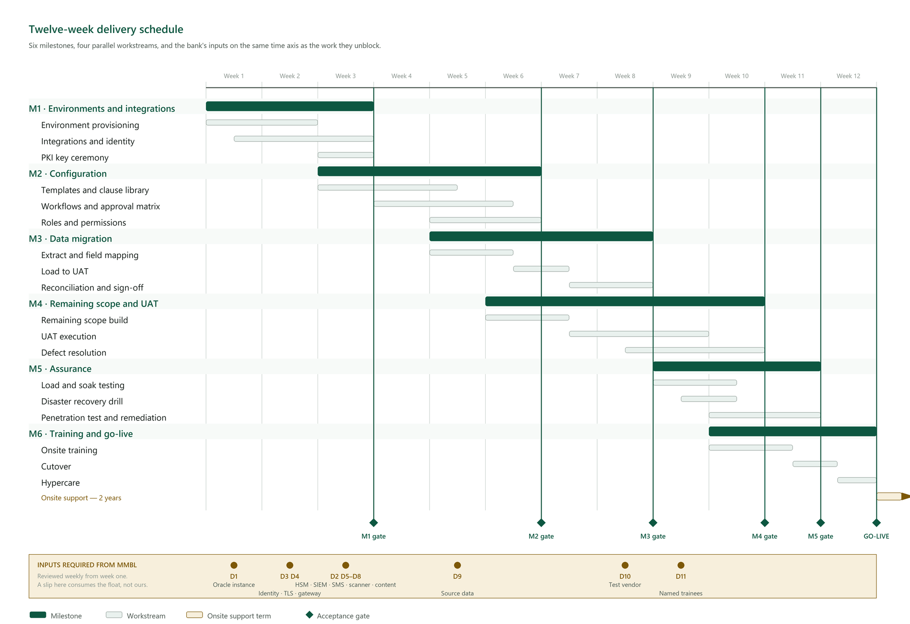

# Project Implementation Plan

**Annexure item 4.** Delivery within the RFP's 2–3 month window, followed by two years of onsite
support after go-live.

---

## 1. Shape of the plan

Twelve weeks, six milestones, four workstreams running in parallel. The plan is built around one
observation: **the critical path is not our engineering — it is MMBL's dependencies.** Eleven
inputs are needed, most of them by week three, and a two-week slip on any of them consumes the
float in a twelve-week window.

The plan is therefore arranged so that construction continues while an integration waits. The
software keystore, console email and local storage backend all let work proceed against a
functioning system, and each is a one-line switch to the real thing when it arrives.

---

## 2. Delivery schedule

*Figure 1 — Twelve weeks, six milestones and four parallel workstreams. The lower lane carries
MMBL's inputs on the same time axis as the work they unblock, because the critical path runs
through them rather than through our engineering.*

Three things the chart is drawn to make visible.

**The milestones overlap deliberately.** Configuration begins before environments are finished
and migration begins before configuration is signed off, because a strictly sequential plan does
not fit twelve weeks. The cost of that overlap is that a slip early does not simply move the end
date, it compresses the milestone downstream — which is why the dependency dates in the lower
lane are the ones to watch.

**Each gate is an acceptance, not a date passing.** A milestone that ends is not a milestone that
is accepted. Every gate has exit criteria stated in §3, and passing it is a joint decision
recorded at the time.

**The float is roughly one week, and it sits in weeks 6 to 8.** It is stated rather than hidden
in the bars, so that when it is consumed both parties know it has been.

---

## 3. Milestones

### M1 · Environments and integrations — weeks 1–3

| Task | Owner | Depends on |
|---|---|---|
| Provision Dev, UAT and Production | MMBL infra | — |
| Deploy the application to all three | Us | Environments |
| **Oracle acceptance gate** — full migration suite plus cross-workspace isolation against a live instance | Us | Oracle instance, **week 1** |
| Connect Entra ID (SAML/OIDC) and SCIM | Us | IdP metadata, reply URL, SCIM token |
| Configure the API gateway | MMBL + us | Kong instance |
| Connect the SIEM feed | Us | Collector endpoint, CEF format agreed |
| Connect mail relay and SMS gateway | Us | Relay details, SMS account |
| Connect the antivirus daemon | Us | Reachable ClamAV |
| Initialise the HSM and perform the key ceremony | MMBL + us, dual witness | HSM on site |

**Exit:** a user authenticates through Entra ID, events reach the SIEM, and the CA hierarchy is
provisioned with the root offline.

**Highest-risk milestone.** Nine of the eleven MMBL dependencies land here. The Oracle instance is
requested in week one rather than week six: platform certification is the gate the whole
delivery passes through (R-07), and finding a problem in week one is a correction while finding
it in week eight is a re-plan.

### M2 · Configuration — weeks 3–6

| Task | Owner |
|---|---|
| Load approved templates and clause library | MMBL Legal + us |
| Configure playbook rules — required, prohibited, altered | MMBL Legal |
| Build approval workflows and the authority matrix | MMBL business + us |
| Map roles to real job functions; configure custom roles | MMBL + us |
| Configure retention, archival and legal-hold matters | MMBL Compliance |
| Configure notification templates and reminder schedules | Us |

**Exit:** an agreement can be originated from a template, approved through the real workflow, and
executed end to end in UAT.

**MMBL's content is the dependency here.** We can build the structure without it; we cannot
validate the structure against content that does not exist.

### M3 · Data migration — weeks 5–8

| Task | Owner |
|---|---|
| Extract from source systems; profile the data | MMBL data owner |
| Map fields; agree the handling of gaps and duplicates | Joint |
| Trial load into UAT | Us |
| Reconcile against source counts | Joint |
| Correct, re-load, re-reconcile | Us |

**Exit:** a reconciliation report accepted by the named data owner, variance under 0.5% or
itemised and accepted in writing.

Loading into UAT first means a mismatch costs a re-run rather than a rollback.

### M4 · Remaining scope and UAT — weeks 6–10

| Task | Owner |
|---|---|
| Deliver bulk send (BB-09) | Us |
| Prepare the UAT book and brief testers | Us |
| Execute UAT scripts | MMBL business |
| Triage and resolve defects | Joint triage, we resolve |
| Regression test each fix | Us |

**Exit:** every script executed with a recorded result; no open S1 or S2 defects; sign-off by the
MMBL business owner.

### M5 · Assurance — weeks 9–11

| Task | Owner |
|---|---|
| Load test — 100 concurrent users, one hour | Us |
| Soak test — a day's peak signature volume | Us |
| Latency verification — OCSP p95 < 200 ms, search p95 < 500 ms | Us |
| DR drill — restore within the 4-hour RTO, verified working | MMBL infra + us |
| Third-party VAPT | MMBL's vendor |
| Remediate findings to the patch SLA | Us |
| Audit chain verification across the migrated history | Us |

**Exit:** performance, recovery and security reports accepted. **Critical VAPT findings block
go-live** — stated now so it is not negotiated later under schedule pressure.

### M6 · Training and go-live — weeks 10–12

| Task | Owner |
|---|---|
| Onsite training for ≥15 named resources | Us |
| Train-the-trainer for branch staff | Us |
| Production cutover | Joint |
| Hypercare — onsite floorwalking | Us |
| Transition to steady-state support | Us |

**Exit:** production live, the training register complete, and the completion report showing at
least fifteen people holding a valid certificate.

---

## 4. Team

| Role | Allocation | Weeks |
|---|---|---|
| Delivery manager | 50% | 1–12 |
| Solution architect | 100% | 1–6, 50% thereafter |
| Backend engineers (2) | 100% | 1–11 |
| Frontend engineer | 100% | 1–10 |
| PKI specialist | 100% | 1–3, on call thereafter |
| DevOps engineer | 100% | 1–4, 50% thereafter |
| QA lead | 100% | 4–12 |
| Migration lead | 100% | 5–8 |
| Trainer | 100% | 10–12 |

Every role has a named second. No single-person dependency survives contact with a twelve-week
schedule (R-23).

---

## 5. MMBL commitment

This is the part most implementation plans understate, and it is the part that decides whether
the dates hold.

| Role | Commitment | When |
|---|---|---|
| Project manager | 50% | 1–12 |
| Business owner | 25%, rising to 50% during UAT | 1–12 |
| Legal content owner | 50% | 3–6 |
| Data owner | 50% | 5–8 |
| Infrastructure engineer | 50% | 1–4 |
| Security lead | 25% | 1–3, 9–11 |
| UAT testers (4–6) | 50% | 8–10 |
| Trainees (≥15) | Full days as scheduled | 10–12 |

---

## 6. Dependency tracker

Reviewed weekly from week one — not discovered when the work blocks.

| # | Dependency | Needed by | Blocks if late |
|---|---|---|---|
| D1 | Oracle instance | **Week 1** | The platform certification gate — schema, isolation and query workload proven before any data is loaded |
| D2 | HSM appliances and issuing CA certificate | Week 3 | Per-signatory signing; falls back to the software store |
| D3 | Entra ID metadata, reply URL, SCIM token | Week 2 | Single sign-on and automated provisioning accepted at go-live |
| D4 | TLS certificates, WAF, load balancer | Week 2 | External access |
| D5 | SIEM collector endpoint and CEF format | Week 3 | Security monitoring |
| D6 | SMS gateway account | Week 3 | OTP identity verification |
| D7 | Antivirus daemon | Week 3 | Upload scanning — **fails closed**, so uploads block |
| D8 | Approved template and clause content | Week 3 | Configuration cannot be validated |
| D9 | Source data extract and named data owner | Week 5 | Migration |
| D10 | Appointed VAPT vendor and window | Week 8 | Security sign-off |
| D11 | Fifteen named trainees | Week 9 | Training acceptance |

**Escalation:** any dependency unmet two weeks before its milestone goes to the steering group
with the specific downstream impact named — not "there is a risk to timeline", but "SCIM
provisioning cannot be accepted, so user onboarding falls back to manual at go-live".

---

## 7. Float, and where it is not

There is roughly one week of float across the plan, concentrated in weeks 6–8 where migration and
UAT preparation overlap.

**There is no float in M1.** Nine dependencies land in the first three weeks and everything else
sequences behind them. A slip there is a slip to go-live, not something absorbed later — which is
why the dependency tracker starts in week one rather than at the first milestone review.

**There is no float in M5.** VAPT is externally scheduled and remediation follows findings. If
the appointed vendor has earlier availability we will take it, precisely to create float that the
plan does not otherwise have (R-14).

---

## 8. Cutover

| Step | Timing | Rollback |
|---|---|---|
| Freeze source systems | Go-live − 2 days | Unfreeze |
| Final delta migration | Go-live − 1 day | Re-run |
| Reconcile | Go-live − 1 day | Abort cutover |
| Switch DNS and gateway routes | Go-live | Revert routes |
| Smoke test the critical paths | Go-live + 1 hour | Revert routes |
| Confirm or roll back | Go-live + 4 hours | Documented rollback |

**The decision point is four hours after cutover, and the rollback is rehearsed.** A rollback plan
nobody has executed is a paragraph, not a plan.

---

## 9. Post-go-live

| Period | Activity |
|---|---|
| Weeks 1–2 | Hypercare — onsite floorwalking, daily triage |
| Weeks 3–4 | Transition to steady-state; adoption metrics reviewed |
| Month 2 | Refresher clinic; first monthly service report |
| Month 6 | Administrator deep-dive; capacity review |
| Ongoing | Two years onsite support per the SLA |

Adoption is measured, not assumed: fewer than 60% of expected agreements originated in-system by
week four triggers a targeted intervention, using the analytics to identify *where* people stop
rather than scheduling another all-hands session (R-24).
