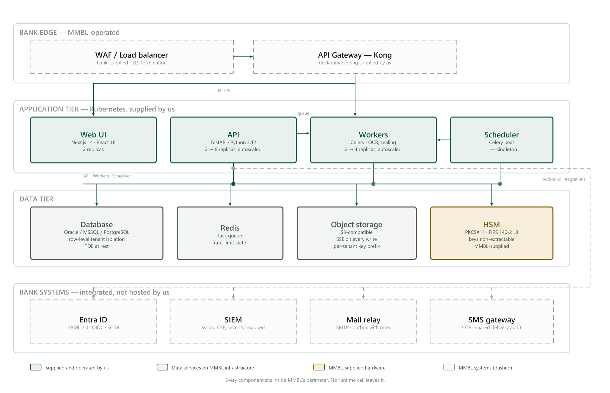
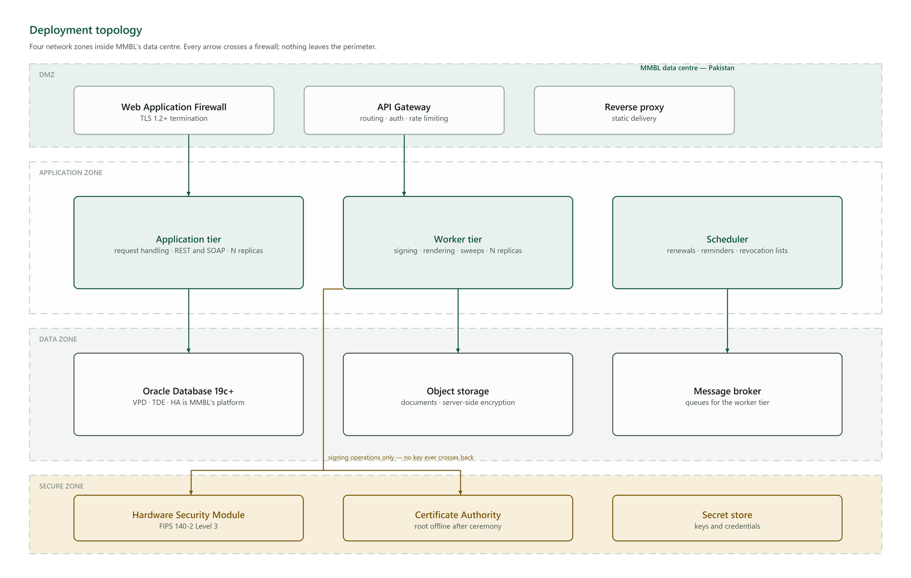
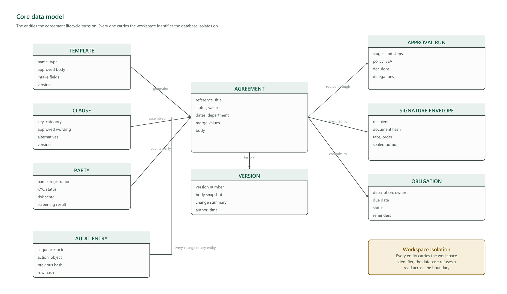
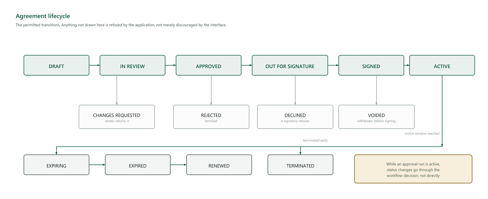
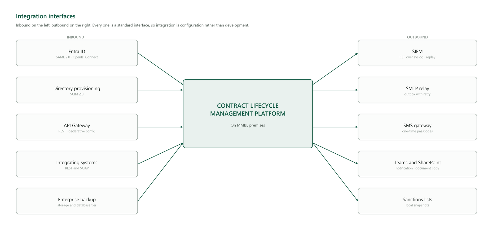

# High-Level and Low-Level Design

**Annexure item 6.** The design of the solution at two levels: the architecture and its
reasoning, then the detail an implementer or a reviewer needs to build against it.

**Part A — High-Level Design** answers what the system is made of, how the pieces relate, and why
the shape was chosen. **Part B — Low-Level Design** answers how each piece works: the deployment
topology by network zone, the data model, the lifecycle, the interfaces, and the security design
inside each tier.

Every figure is drawn from the design rather than captured from a running screen, so the diagram
and the text cannot drift apart.

---

# Part A — High-Level Design

## 1. Design principles

Five decisions govern everything below. Each is a constraint accepted deliberately, and each has
a cost stated alongside it — a principle with no cost attached has not been applied to anything.

| Principle | What it means in practice | What it costs |
|---|---|---|
| **On-premises, self-contained** | No component requires a hosted service to function. Every dependency is either inside MMBL's perimeter or optional | Features that would be trivial with a cloud service are built rather than bought |
| **Isolation in the database, not only the application** | Access boundaries are enforced by Oracle Virtual Private Database, beneath the application | Every schema change must consider the policy as well as the table |
| **Controls fail closed** | If a security control cannot function, the operation is refused rather than allowed | An unreachable scanner blocks uploads. That is the intended behaviour |
| **Evidence over assertion** | Every state change is recorded in a tamper-evident trail, and signed documents verify without the system | Write amplification on every transaction, accepted for what it buys |
| **Standard interfaces** | Federation, provisioning, logging and gateway integration all use published standards | No proprietary connector, and no lock-in for MMBL |

## 2. Solution architecture

*Figure 1 — Solution architecture. Every component sits inside the bank's perimeter.*

**Four tiers, deliberately not four services.** The request tier answers users and integrating
systems; the worker tier does everything slow — signing, rendering, sweeps — so a signature
ceremony cannot make a page slow; the data tier holds the record; the secure zone holds key
material and nothing else.

The worker tier is separated from the request tier because their failure modes and scaling
profiles differ: a queue backlog must never become a timeout on a user's screen, and month-end
renewal volume must be absorbable without provisioning request capacity for it.

**Why a modular application rather than a distributed service mesh.** RFP §4b expresses a
preference for microservices. The deviation is declared here rather than left for an evaluator to
notice. The operational requirement is a deployment MMBL's own team can run: a service mesh
multiplies the operational surface — service discovery, distributed tracing across a dozen hops,
partial-failure semantics, an order-of-magnitude harder debugging story — without serving any
requirement in this RFP. The properties the preference exists to secure are all delivered:
independent scaling of the heavy asynchronous work, horizontal scaling of the request tier, and
API-driven modularity. The decomposition path remains available if MMBL later requires it,
because the module boundaries already exist.

## 3. Component responsibilities

| Component | Responsibility | Scaling |
|---|---|---|
| Request tier | Authentication, authorisation, business operations, REST and SOAP interfaces | Horizontal, stateless |
| Worker tier | Document rendering, cryptographic signing, sealing, bulk dispatch, extraction | Horizontal, queue-driven |
| Scheduler | Renewal sweeps, obligation reminders, revocation list publication, archival and purge | Single active instance |
| Document store | Executed and draft documents, encrypted at rest | MMBL's storage platform |
| Database | The system of record, including the audit trail | MMBL's Oracle platform |
| Certificate authority | Issuance, revocation, revocation responses | Within the secure zone |
| Hardware security module | Key generation and signing. Keys are non-extractable | MMBL-supplied appliance |

## 4. Key architectural decisions

| # | Decision | Alternative considered | Why this one |
|---|---|---|---|
| 1 | Modular application, separate worker tier | Distributed microservices | Operability by MMBL's own team; the scaling properties are delivered without the operational surface |
| 2 | Isolation by Virtual Private Database | Application-layer filtering alone | A defect in application logic still cannot read across the boundary |
| 3 | Per-signatory certificates | One shared organisational certificate | A shared certificate cannot attribute a signature to a person, which is what the requirement asks for |
| 4 | Keys generated inside the HSM | Keys generated then imported | An imported key existed outside the device once, and once is enough |
| 5 | Audit chain ordered by sequence | Ordered by timestamp | Two entries in the same clock tick would otherwise order arbitrarily, and a chain that verifies under one ordering and not another proves nothing |
| 6 | Evidence embedded in the document | Evidence held in the system | A signature that can only be verified by the system that made it is worth little in a dispute years later |

---

# Part B — Low-Level Design

## 5. Deployment topology

*Figure 2 — Four network zones. Every arrow crosses a firewall.*

| Zone | Contents | Inbound from | Rule |
|---|---|---|---|
| DMZ | Web application firewall, API gateway, reverse proxy | MMBL's corporate network and, for signing links, the internet through the bank's own edge | TLS 1.2+ terminates here |
| Application | Request tier, worker tier, scheduler | DMZ only | No direct inbound from outside the DMZ |
| Data | Oracle database, object storage, message broker | Application zone only | No inbound from the DMZ at all |
| Secure | HSM, certificate authority, secret store | Worker tier only, for signing operations | **No key material ever crosses back out** |

**Every component declares the ports and destinations it requires**, and default-deny network
policy is supplied with the deployment manifests. Nothing requires a flat network or
unrestricted egress, which is what makes the micro-segmentation requirement in §4d answerable
rather than aspirational.

**Environments.** Development, UAT and production are separately credentialed and built from the
same declarative configuration. One artefact is promoted by digest across all three, so what is
accepted in UAT is bit-for-bit what reaches production.

## 6. Data model

*Figure 3 — The entities the agreement lifecycle turns on.*

| Entity | Holds | Notable design point |
|---|---|---|
| Template | Approved body, intake field definitions, version | The approved wording is frozen in a version snapshot, so "generated from the approved template" stays provable after the template is edited |
| Clause | Approved wording, ranked alternatives, version | A drafter may substitute only an approved alternative; the substitution is recorded |
| Party | Registration, KYC status, risk score, screening result | Duplicate onboarding is blocked; an override requires a reason and is audited |
| Agreement | Reference, status, value, dates, merge values, body | Carries the merge values it was generated from, so the draft can be explained later |
| Version | Body snapshot, change summary, author, time | A snapshot, not a diff — reconstructing a body from a chain of diffs fails the moment one is lost |
| Approval run | Stages, steps, policy, SLA, decisions, delegations | Stages are ordered; steps within a stage are concurrent |
| Signature envelope | Recipients, document hash, field placement, sealed output | The hash binds the envelope to exactly the content that was signed |
| Obligation | Description, owner, due date, status | Tracked across the whole portfolio, not per agreement |
| Audit entry | Sequence, actor, action, object, previous hash, row hash | Append-only; see §9 |

**Every entity carries the workspace identifier the database isolates on.** MMBL's installation
is dedicated, so in practice it holds one workspace — the boundary exists so a subsidiary or a
ring-fenced business unit can be separated later as configuration rather than a re-architecture.

**Two columns are denormalised deliberately.** The actor's name is copied into each audit entry
so the record survives the user being renamed or deactivated, and the object's label is captured
at the time of the action so an entry still reads correctly after the object is renamed. A record
that changes meaning when unrelated data changes is not a record.

## 7. Agreement lifecycle

*Figure 4 — Permitted transitions. Anything not drawn is refused.*

The state machine is enforced in the service layer. An attempt to move an agreement to a state
not reachable from its current one is refused with an explicit conflict, not silently ignored.

**While an approval run is active, generic status changes are blocked** — the agreement moves
through the workflow decision instead. Without that rule, an agreement could be advanced past an
approval that had not been given.

**Suspension of a certificate and termination of an agreement are different things**, and both
are reversible only where the standard allows it. Certificate suspension is published as a real
revocation hold that can be withdrawn; agreement termination is not reversible and requires
multi-role sign-off.

## 8. Integration design

*Figure 5 — Inbound and outbound interfaces.*

| Direction | Interface | Standard | Failure behaviour |
|---|---|---|---|
| Inbound | Single sign-on | SAML 2.0, OpenID Connect | Password with multi-factor remains available, so identity is never on the critical path |
| Inbound | User provisioning | SCIM 2.0 | Manual administration remains available |
| Inbound | Gateway | REST, declarative configuration | — |
| Inbound | Integrating systems | REST and SOAP | — |
| Outbound | SIEM | CEF over syslog | Buffered, with replay for the period a collector was unavailable |
| Outbound | Mail | SMTP relay | Outbox with retry; delivery state recorded rather than assumed |
| Outbound | SMS | HTTP gateway | Shares one delivery audit with mail |
| Outbound | Collaboration | Notification and document copy | Non-blocking; failure is recorded, not propagated |

**Delivery state is recorded, never assumed.** A message that failed to send is a visible failed
record with its reason, not an absence. The difference matters at exactly the moment somebody
asks why a counterparty says they never received the agreement.

## 9. Security design

### 9.1 Authentication and authorisation

Enforced password policy; multi-factor by time-based one-time passcode, passkeys, or email
fallback; federated sign-on where MMBL's identity provider is configured. The access token is
short-lived and held in memory only — never in browser storage, where a script could read it. The
refresh token is an httpOnly, secure, same-site cookie, rotated on every use, **with reuse
detection**: presenting an already-rotated token revokes the entire session chain and raises an
alert, because the only way a rotated token exists in a second place is that it was taken.

Authorisation is enforced in the service layer rather than by hiding controls, so an API call
cannot reach what the interface does not show. Step-up re-authentication is bound to the specific
action and object, single-use and time-limited.

### 9.2 Cryptography

| Purpose | Mechanism |
|---|---|
| Data at rest — database | Oracle Transparent Data Encryption at the tablespace |
| Data at rest — secrets | AES-256 with a rotating key chain, so a database export alone yields nothing usable |
| Data at rest — documents | Server-side encryption on the object store |
| Data in transit | TLS 1.2 or higher, verified at start-up rather than assumed |
| Signing keys | Generated inside the HSM, marked non-extractable; the custody interface has no export method |
| Document signatures | PAdES-LTV — embedded chain, revocation data and trusted timestamp |

### 9.3 The audit chain

Each entry carries the hash of its predecessor and its own keyed hash over both. Altering a field
changes the entry's hash; because the next entry incorporates it, **every subsequent entry fails
to verify**. Deleting an entry breaks the link between its neighbours. Inserting one gives it no
valid predecessor.

**Ordering is by a monotonic sequence assigned under a lock, and that is load-bearing.** Ordering
by timestamp would mean two entries written in the same clock tick order arbitrarily — an entry
could chain past its true predecessor, and deleting the skipped entry would leave a chain that
still verified. The one thing the mechanism exists to detect would become undetectable, on a tie
that a coarse system clock makes common rather than rare.

The chain key is held in configuration, not in the database, so database access alone cannot
recompute a valid chain over altered data. Verification is delivered to MMBL and reports the
first divergent entry.

## 10. Performance and capacity design

| Target | Design decision that carries it |
|---|---|
| Revocation response under 200 ms | Single indexed lookup on the serial; elliptic-curve responder key, because signature cost dominates the response |
| Search under 500 ms across ten years | Database-native full-text indexing, plus a hot/cold retention split so the searched set does not grow without bound |
| Signature ceremony under 5 s | Rendering and sealing are asynchronous; the user is not held while a document is produced |
| Month-end absorption | Worker tier scales independently of the request tier, so a batch cannot slow a page |

Targets are proven by load and soak testing against a corpus sized to MMBL's ten-year volumes,
not a demonstration set.

## 11. Availability and recovery design

| Tier | Availability design | Owner |
|---|---|---|
| Request | Multiple replicas, disruption budgets, health probes | Solution |
| Worker | Multiple replicas; work is queued, so a lost worker is retried rather than lost | Solution |
| Scheduler | Single active instance; every job is idempotent, so a restart re-runs safely | Solution |
| Database | High availability on MMBL's Oracle platform | MMBL |
| Storage | Replication on MMBL's storage platform | MMBL |

**Every scheduled job is idempotent and reports its own outcome** — success, failure, duration and
how many items it acted on — so "the sweep ran and found nothing" is distinguishable from "the
sweep did not run". Without that distinction a dead job and a quiet one look identical, and the
first symptom is a renewal missed months later.

Backups are encrypted, held offsite and **restore-verified**. Documents and database are captured
on the same schedule, so a restore produces a consistent state rather than records pointing at
documents that no longer exist.

## 12. Figures

| Figure | Subject | Level |
|---|---|---|
| 1 | Solution architecture | HLD |
| 2 | Deployment topology by network zone | LLD |
| 3 | Core data model | LLD |
| 4 | Agreement lifecycle | LLD |
| 5 | Integration interfaces | LLD |

The PKI design — certificate hierarchy, key custody, registration and issuance, signature
format, and accredited-root chaining — is carried at the same level of detail in the PKI
Architecture document, which is Annexure item 13.
